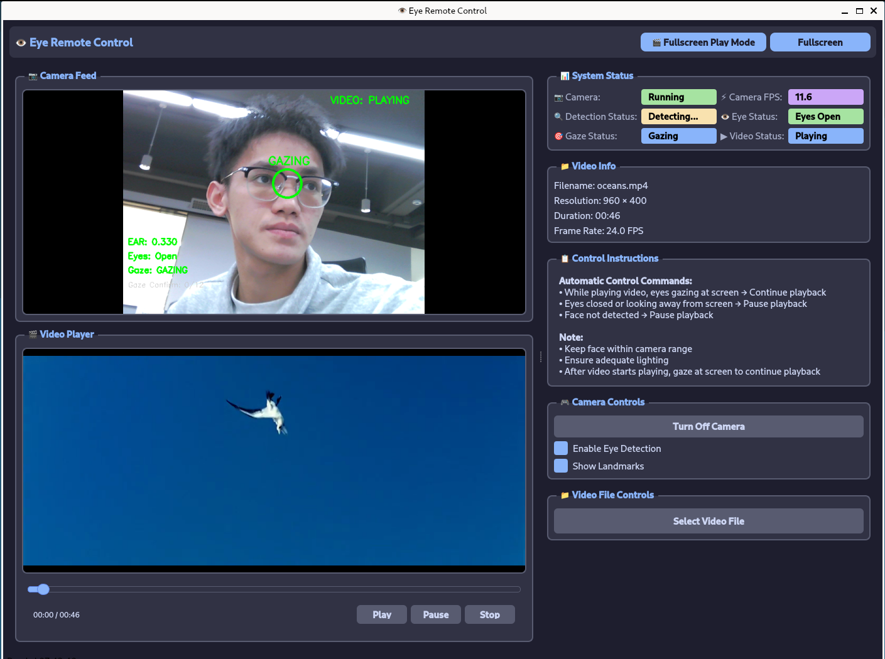

# 👁️ 眼睛遥控器 - Eye Remote Control

[English](README.md) | 中文

本项目基于 [Quectel Pi H1智能主控板](https://developer.quectel.com/doc/sbc/Quectel-Pi-H1/zh/Applications/Open-Source-Projects/eye_remote_control/eye_remote_control.html)开发，充分利用其强大的计算能力和多媒体处理能力，实现了低延迟、较高准确率的眼部追踪功能。

眼睛遥控器是一个智能控制系统，通过检测用户眼部状态来控制视频播放：注视屏幕时继续播放，闭眼或离开屏幕时自动暂停。



核心功能：
- 当检测到用户眼睛睁开并注视屏幕时，系统会自动播放或保持视频播放状态。
- 当检测到用户闭眼、转移视线或离开屏幕时，系统会立即暂停当前播放的视频。
- 支持自动播放下一个视频文件（按文件名字母顺序循环播放）

## 🎯 功能特点

- **精准眼动检测**: 使用 Google MediaPipe FaceMesh 实时检测用户眼部状态，精度高、延迟低
- **智能视线追踪**: 通过分析面部关键点位置变化判断用户是否在注视屏幕
- **自动化控制**: 根据视线状态自动播放或暂停视频，无需手动干预
- **全屏沉浸体验**: 提供全屏播放模式，减少干扰，专注观看
- **多格式支持**: 支持 MP4、AVI、MOV、MKV 等多种常见视频格式
- **自动播放队列**: 视频播放完成后自动播放同目录下的下一个视频文件
- **双界面模式**: 支持常规窗口模式和全屏模式自由切换
- **实时状态监控**: 实时显示摄像头 FPS、眼部状态、视线状态等关键信息

## 🖥️ 界面展示

主界面分为三个主要区域：
1. **摄像头画面显示区** - 实时显示摄像头捕捉的画面及眼部标记点
2. **视频播放区** - 显示当前加载的视频内容
3. **控制面板区** - 包含系统状态信息和各种控制选项

### 主要界面元素

- 📷 **摄像头区域**: 实时显示摄像头画面，带有面部和眼部关键点标记
- 🎬 **视频播放区域**: 展示正在播放的视频内容
- 📊 **系统状态面板**: 显示摄像头、检测、眼部和视线状态
- 📁 **视频信息面板**: 展示当前视频的基本信息
- 📋 **控制说明面板**: 显示操作指南和控制逻辑
- 🎮 **控制选项面板**: 提供摄像头开关、检测开关等功能
- 📁 **文件控制面板**: 用于选择和管理视频文件

## ⚙️ 工作原理

### 眼部状态检测

系统使用先进的计算机视觉技术进行眼部状态检测：

1. **面部特征点检测**: 使用 MediaPipe FaceMesh 检测面部468个关键点
2. **眼部纵横比计算**: 采用标准6点法计算眼部纵横比(EAR)
3. **眨眼检测**: 通过EAR阈值判断眨眼动作
4. **眼睛开闭状态**: 结合历史状态判断眼睛是否睁开或闭合

### 视线追踪算法

视线追踪通过以下步骤实现：

1. **眼部中心定位**: 计算双眼中心点坐标
2. **面部稳定性分析**: 结合鼻部关键点分析头部稳定性
3. **注视状态判断**: 通过位置方差算法判断用户是否稳定注视屏幕
4. **状态机跟踪**: 使用多级状态机提高检测准确性

### 视频控制逻辑

智能视频控制基于以下规则：

- ✅ **继续播放**: 用户注视屏幕且眼睛睁开时
- ⏸️ **暂停播放**: 用户闭眼、转移视线或离开屏幕时
- ▶️ **自动恢复**: 用户重新注视屏幕时自动恢复播放
- 🔁 **自动下一集**: 视频播放完成后自动播放下一个文件

### 自动播放逻辑

系统支持智能播放列表管理：

- 自动扫描当前目录下的视频文件
- 按文件名字母顺序排序
- 循环播放所有视频文件
- 支持无缝切换到下一个视频

## 📋 系统要求

### 硬件要求
- Quectel Pi H1 智能主控板
- 兼容的USB摄像头 
- 显示器 (DSI 触控屏)
- 音频输出设备（扬声器或耳机）

### 软件要求
- 操作系统：Debian 13（Quectel Pi H1 默认系统）
- 视频播放：ffmpeg
- Python：Python 3
- 依赖组件
  - Python 3.9-3.12
  - OpenCV-Python == 4.8.1.78
  - MediaPipe == 0.10.9
  - NumPy == 1.24.3
  - PySide6 == 6.5.3
  - protobuf == 3.20.3
  - av==16.0.1


## 🚀 安装与运行

### 安装步骤
#### 配置python环境
   目前系统默认的python版本为3.13，而我们使用的MediaPipe模型需要的开发环境在python3.9-3.12，需要重新指定python路径，系统中已经安装了python3.10，我们修改python默认路径即可。

```bash 
#备份当前Python路径链接
sudo cp /usr/bin/python3 /usr/bin/python3.backup
#删除当前Python路径链接
sudo rm /usr/bin/python3
# 创建新的路径链接指向Python 3.10
sudo ln -s /usr/bin/python3.10 /usr/bin/python3
#验证修改，输出为Python 3.10.15版本即配置成功
ls -l /usr/bin/python3
python3 --version
```
#### 克隆项目代码：
```bash
git clone <repository-url>
cd demo-eye-remote-control
```

#### 创建虚拟环境（推荐）：
```bash
python3 -m venv ~/mediapipe_env
source ~/mediapipe_env/bin/activate
```

#### 更新pip源：
```bash
pip install --upgrade pip
```

#### 安装依赖：
```bash
pip install -r requirements.txt
```

#### 安装ffmpeg
```bash
sudo apt update
sudo apt install -y ffmpeg
```

#### 运行程序：
```bash
python3 main.py
```

或者使用启动脚本：
```bash
chmod +x start.sh
./start.sh
```

### 首次运行设置

1. 确保摄像头已正确连接到设备
2. 调整摄像头角度，确保能清晰拍摄到面部
3. 保证充足的照明条件，避免强逆光
4. 坐在摄像头前适当距离


## 🎛️ 使用说明

### 基本操作流程

1. **启动程序**: 程序启动后会自动开启摄像头并开始检测
2. **加载视频**: 点击"选择视频文件"按钮加载想要播放的视频
3. **开始观看**: 系统会根据您的视线状态自动控制播放/暂停
4. **切换模式**: 可使用全屏播放模式获得更好的观看体验

### 控制逻辑详解

| 状态 | 行为 | 说明 |
|------|------|------|
| 注视屏幕 + 眼睛睁开 | 继续播放 | 系统检测到您正在观看 |
| 闭眼或视线移开 | 自动暂停 | 离开或闭眼时暂停播放 |
| 人脸离开摄像头 | 自动暂停 | 超过1秒未检测到人脸 |

### 界面功能说明

#### 主要功能按钮
- **全屏模式**: 点击"F11"或界面上的全屏按钮进入全屏化界面
- **全屏播放模式**: 全屏播放视频，并根据实时识别结果控制视频播放
- **摄像头开关**: 可随时开启或关闭摄像头
- **检测开关**: 可手动启用或禁用眼部检测功能
- **标记点显示**: 可视化显示眼部关键点和检测结果


## 📁 项目结构

```
eye-remote-control/
├──assets                      # 静态资源文件
├── src/                        # 源代码目录
│   ├── eye_detector.py         # 眼部检测核心逻辑
│   ├── video_capture.py        # 视频采集线程
│   ├── video_player.py         # 视频播放器线程
│   ├── fullscreen_player_mode.py  # 全屏播放模式界面
│   ├── log.py                  # 日志记录模块
│   ├──main.py                  # 主程序入口
├── README.md                   # 中文项目说明文档
├── README_en.md                # 英文项目说明文档
├── requirements.txt            # 依赖包列表
└── start.sh                    # 启动脚本
```

## 🛠️ 配置参数

主要可配置参数位于 [src/eye_detector.py](src/eye_detector.py) 中：

| 参数名 | 默认值 | 说明 |
|--------|--------|------|
| `GAZING_STABILITY_THRESHOLD` | 35 | 注视稳定性阈值 |
| `GAZING_CONFIRMATION_FRAMES` | 12 | 确认注视所需的连续帧数 |
| `GAZING_BREAK_FRAMES` | 15 | 取消注视所需的连续不稳定帧数 |
| `EAR_BLINK_THRESHOLD` | 0.18 | 眨眼判定阈值 |
| `EAR_OPEN_THRESHOLD` | 0.25 | 眼睛完全张开阈值 |
| `BLINK_FRAME_THRESHOLD` | 4 | 眨眼持续时间阈值（帧数） |


## 报告问题

欢迎提交Issue和Pull Request来改进此项目。

